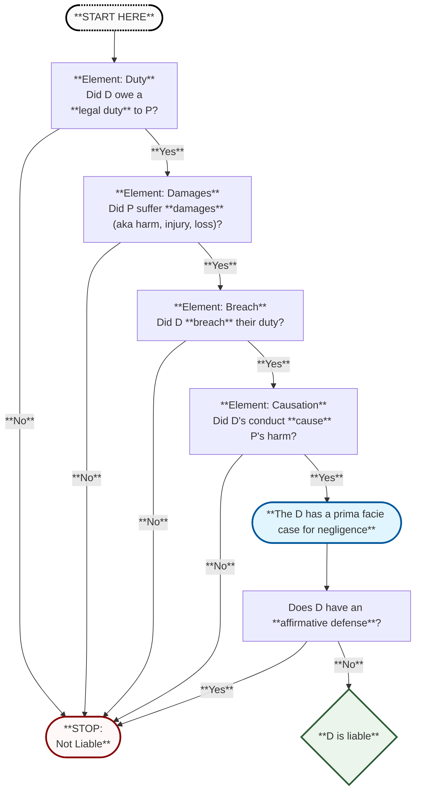
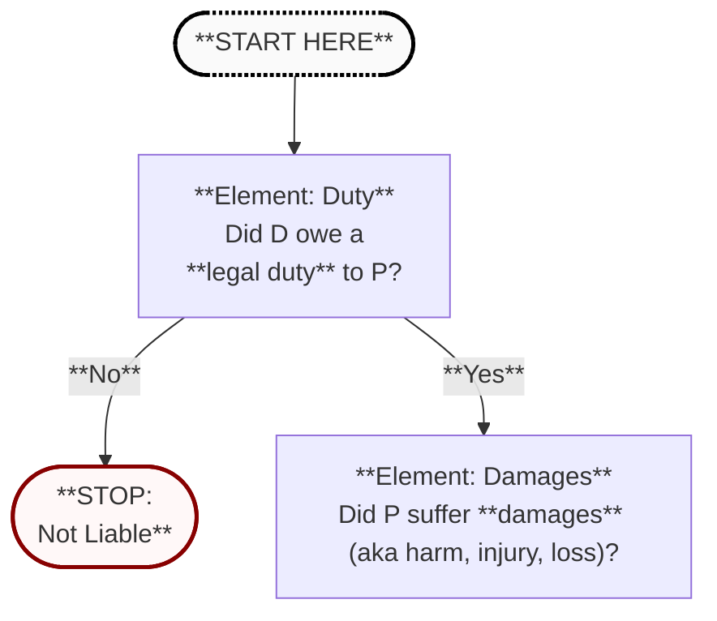
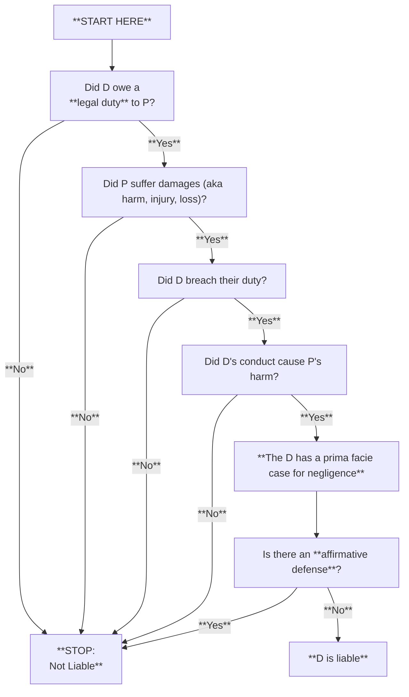
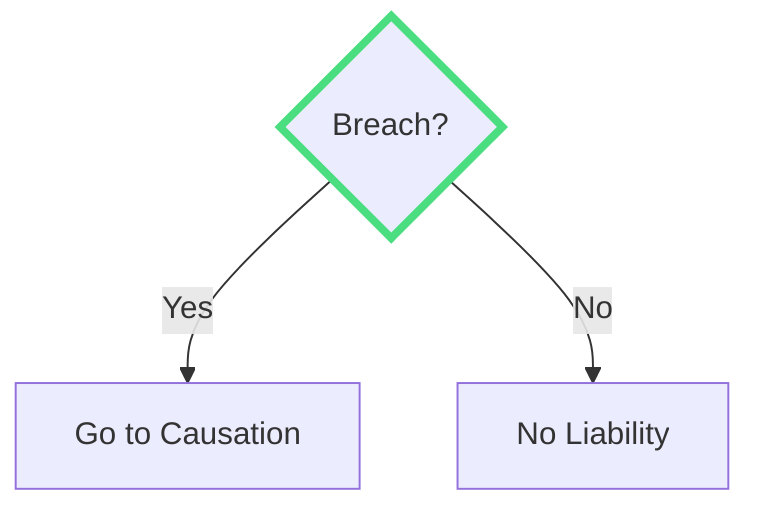
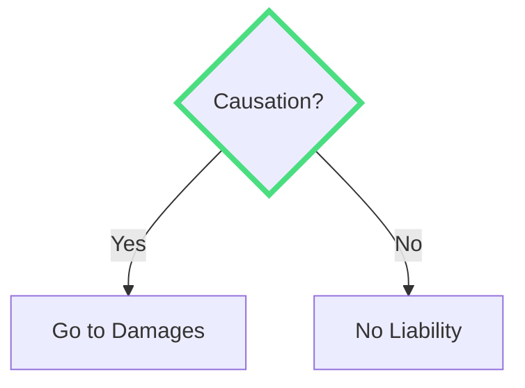

# Negligence
   
---
layout: center
alias: overview
---

# Overview: Negligence in General

<v-clicks>

1. **_Prima Facie_ Case for Liability**  
   > **Note:** "*Prima facie* case" means:  
    **a.** P has alleged sufficient evidence to support a claim at **face value**, and  
    **b.** P's evidence is rebuttable by defenses.
   - **Duty** (to others)
   - **Breach** (of duty)
   - **Damages** (suffered by another)
   - **Causation** (of damages)

2. **Defenses to Liability**
   - Failure of Proof
   - Affirmative Defenses

</v-clicks>

---
layout: center
alias: overview_map
---

<Transform :scale="0.82" origin="center">

</Transform>

---
layout: two-cols
alias: zoom_duty
---

<v-clicks>

 - Duty
 - If No → Not Liable
 - If Yes → Damages?

</v-clicks>
::right::

---

---

layout: two-cols
alias: overview_map
---
<Transform :scale="0.75" origin="center">

</Transform>
---

# Element 1: Duty
Did D have a duty to P?

---
layout: center
class: text-center
alias: not_liable
---

# Outcome
D is not liable for negligence.

---
layout: center
alias: breach
decision: true
question: "Breach?"
yesTarget: causation
noTarget: not_liable
---

# Element 2: Breach
Did D breach the duty to P?

---
layout: center
alias: causation
decision: true
question: "Causation?"
yesTarget: damages
noTarget: not_liable
---
# Element 3: Causation
Did the defendant's breach cause harm?

---
layout: center
alias: damages
decision: true
question: "Causation?"
yesTarget: 4
noTarget: 7
dragPos:
  square: -109,0,0,0
---

