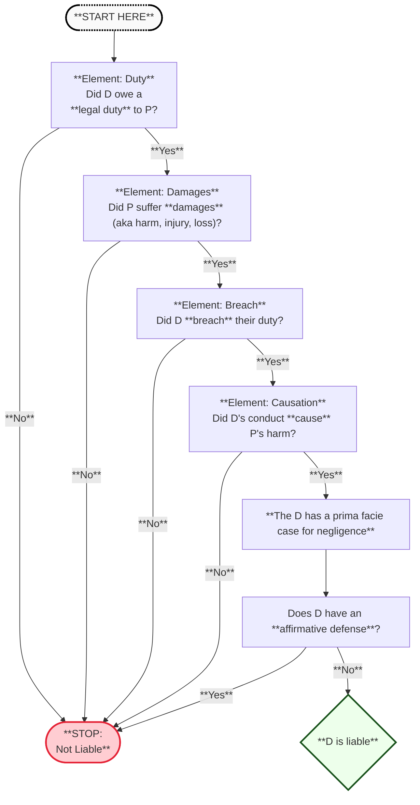

# Starting slide
---
layout: center
alias: overview
---

# Overview: Negligence in General

<ol class="legal-list">
  <li>
    <i>Prima Facie</i> Case for Liability

    

      Note: Sufficient evidence to support a claim at <b>face value</b>; rebuttable by defenses.
    

    <ol class="alpha-list">
      <li>Duty (to others)</li>
      <li>Breach (of duty)</li>
      <li>Damages (suffered by another)</li>
      <li>Causation (of damages)</li>
    </ol>
  </li>

  <li>
    Defenses to Liability
    <ol class="alpha-list">
      <li>Failure of Proof (insufficient evidence)</li>
      <li>Affirmative Defenses</li>
    </ol>
  </li>
</ol>

---
layout: center
---

 

---

# Element 1: Duty
Did D have a duty to P?

---
layout: center
class: text-center
alias: not_liable
---

# Outcome
D is not liable for negligence.

---
layout: center
alias: breach
decision: true
question: "Breach?"
yesTarget: causation
noTarget: not_liable
---

# Element 2: Breach
Did D breach the duty to P?

---
layout: center
alias: causation
decision: true
question: "Causation?"
yesTarget: damages
noTarget: not_liable
---
# Element 3: Causation
Did the defendant's breach cause harm?

---
layout: center
alias: damages
decision: true
question: "Causation?"
yesTarget: 4
noTarget: 7
---
