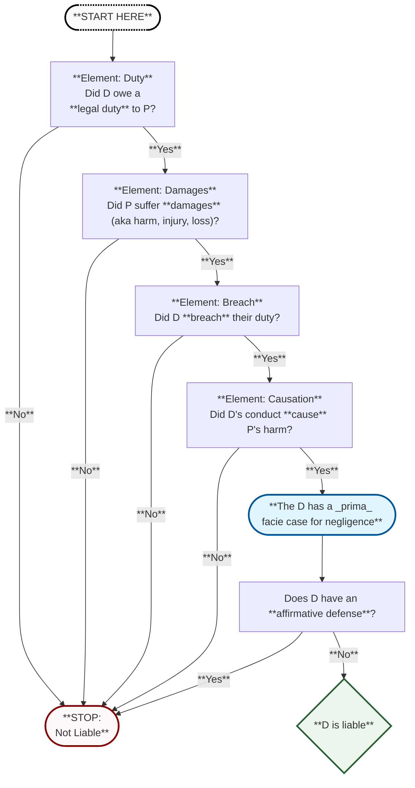
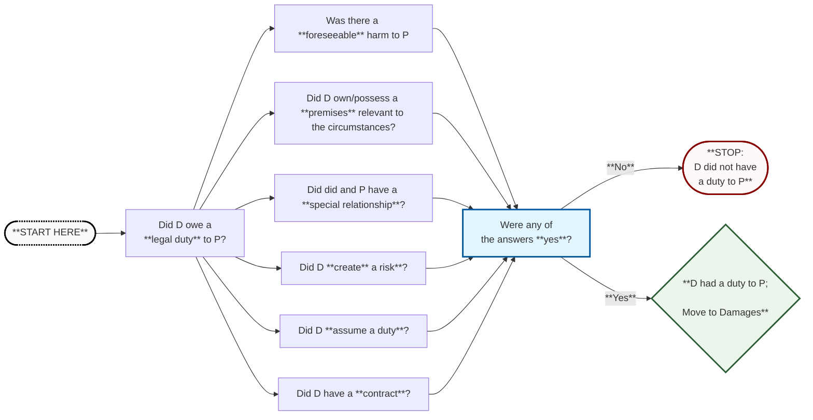
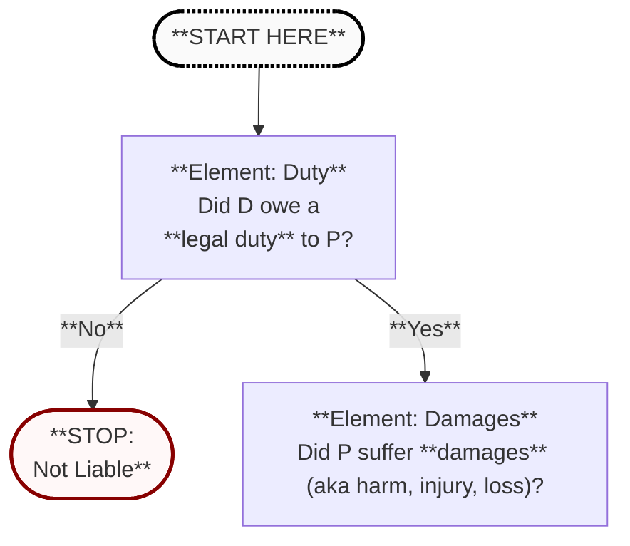
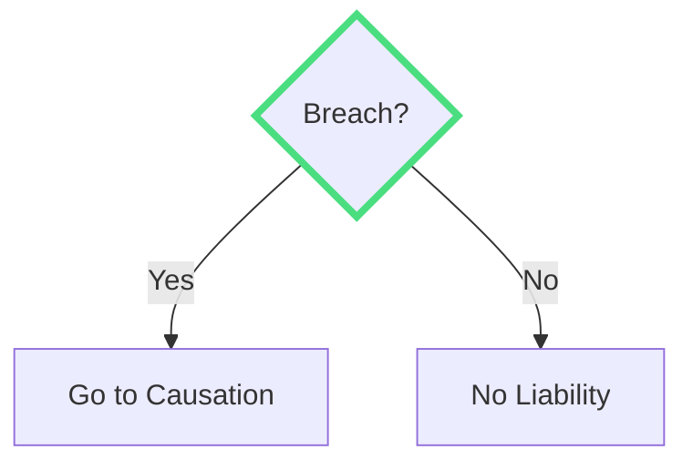
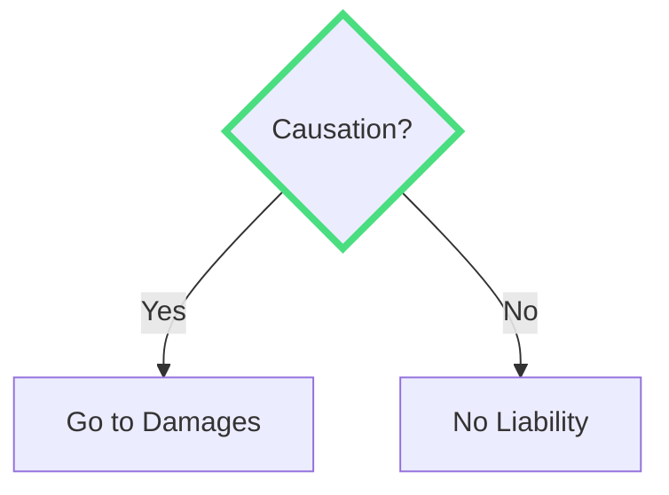
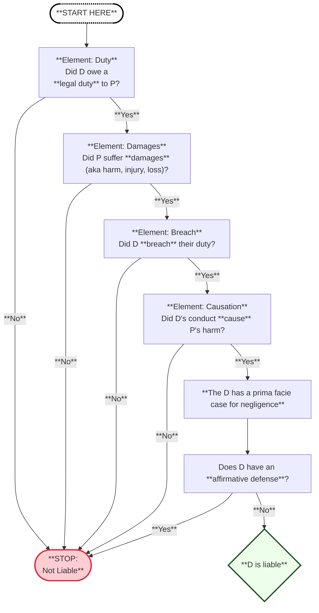

---
# try 'default' to start simple
theme: default
# like them? see https://unsplash.com/collections/94734566/slidev
background: none
# slide transition: https://sli.dev/guide/animations.html#slide-transitions
transition: slide-left
# enable MDC Syntax: https://sli.dev/features/mdc
mdc: true\
hideArrow: false
# https://sli.dev/features/drawing
drawings:
   persist: false
aspectRatio: 16/9
# Global slide canvas sizing (recommended)
canvasWidth: 760  # was 980; smaller = everything appears larger on screen

title: Negligence & Products Liability
layout: center
alias: start

defaults:
  layout: zoomable

---

# Negligence

---
class: -mt-8
alias: overview
---

## Overview: Negligence in General

<v-clicks>

1. **_Prima Facie_ Case for Liability**  
   > **Note:** "*prima facie* case" means:  
   > **(a)** P has alleged sufficient evidence to support a claim at **face value**, and  
   > **(b)** P's evidence is rebuttable by defenses.

   - **Duty** (to others)
   - **Breach** (of duty)
   - **Damages** (suffered by another)
   - **Causation** (of damages)

2. **Defenses to Liability**
   - Failure of Proof
   - Affirmative Defenses

</v-clicks>

---
alias: overview_flowchart
class: -mt--45
---

<Transform :scale="2.0" origin="left">

Overview Flowchart
 

</Transform>

---
---

---
class: -mt-5
alias: duties
---

### When is there a duty?

<v-clicks>

1. **Foreseeability**  
   - Common law duty to avoid causing foreseeable harm to others

2. **On the Premises**
   - Owners/Possessors of a premises owe special duty to warn

3. **Special Relationships**
   - Special duties owed to certain relationship counterparts

4. **Creation of Risk**
   - Duty created when person creates a risk to others

5. **Assumption of Duty**
   - Duty exists when person assumes a duty that didn't previously exist

6. **Contract**
   - Contracts create duties between the contracting parties

</v-clicks>

---
class: -mt--20
---

<Transform :scale="2.2" origin="left">

</Transform>

---
---
# When is there a duty?

---
alias: overview_map
zoom: 1.3
---

x

---
alias: placeholder
---
# Element 1: Duty
Did D have a duty to P?

what's up?

---
class: text-center
alias: not_liable
---

# Outcome

D is not liable for negligence.

---
alias: breach
decision: true
question: "Breach?"
yesTarget: causation
noTarget: not_liable
---

# Element 2: Breach
Did D breach the duty to P?

---
alias: causation
decision: true
question: "Causation?"
yesTarget: breach
noTarget: damages
---

# Element 3: Causation
Did the defendant's breach cause harm?

---
alias: damages
decision: true
question: "Causation?"
yesTarget: 4
noTarget: 7
dragPos:
  square: -109,0,0,0
---

