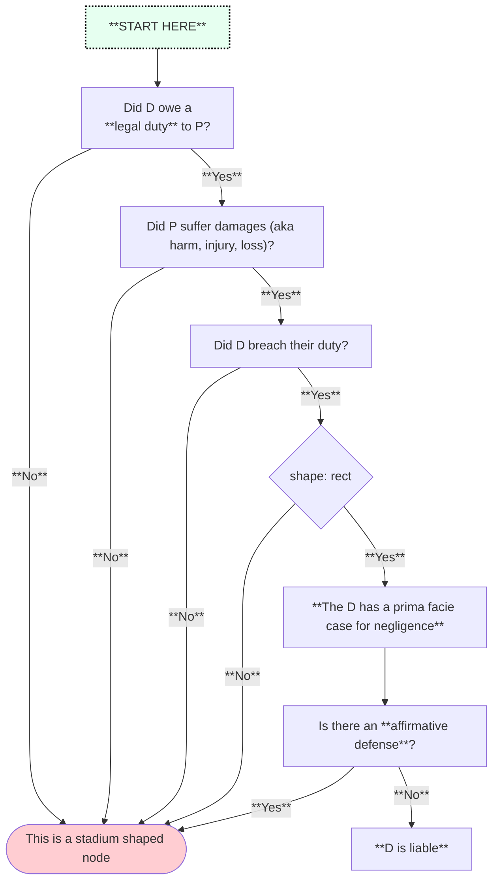

x

```mermaid
graph TD
    z1["**START HERE**"] --> du["Did D owe a<br/>**legal duty** to P?"]
    du -- **No** --> z2["**STOP:<br>Not Liable**"]
    du -- **Yes** --> da["Did P suffer damages (aka harm, injury, loss)?"]
    da -- **No** --> z2
    da -- **Yes** --> b["Did D breach their duty?"]
    b -- **No** --> z2
    b -- **Yes** --> ca["Did D's conduct cause P's harm?"]
    ca -- **No** --> z2
    ca -- **Yes** --> p["**The D has a prima facie case for negligence**"]
    p --> aa[Is there an **affirmative defense**?]
    aa -- **No** --> l["**D is liable**"]
    aa -- **Yes** --> z2
  
    z2([This is a stadium shaped node])
    ca{ shape: rect}
    style z1 stroke-width:2px,stroke-dasharray: 2,fill:#e6fff0,stroke:#000000
    style z2 fill:#FFCDD2
```

x
