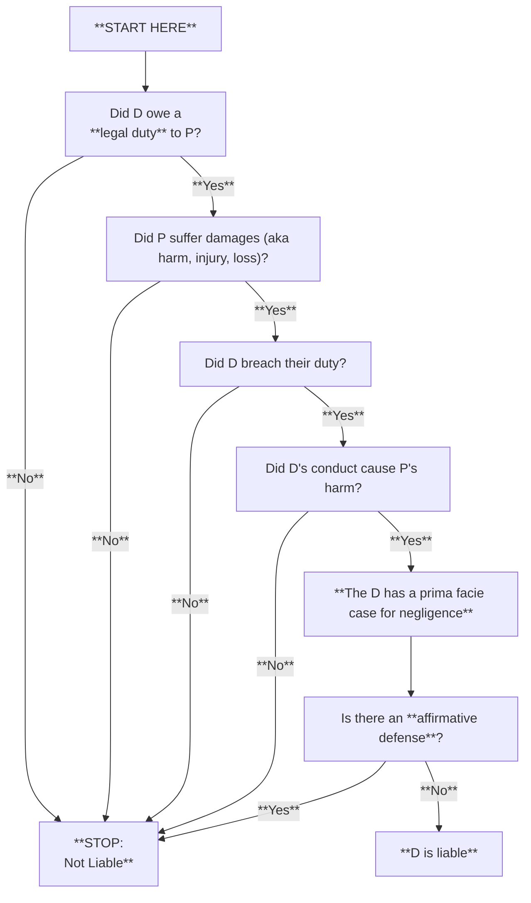
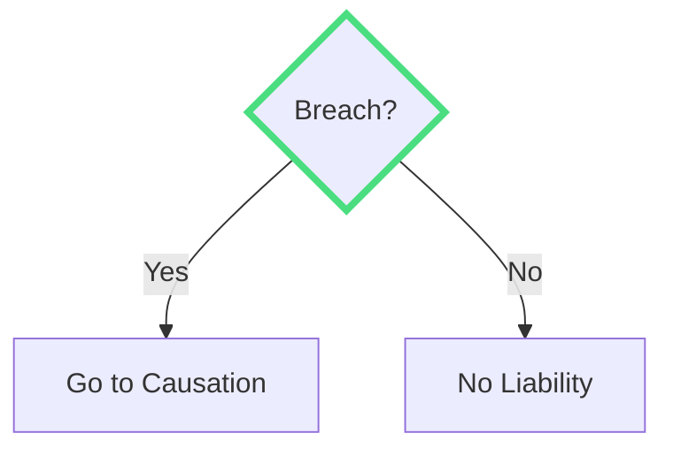
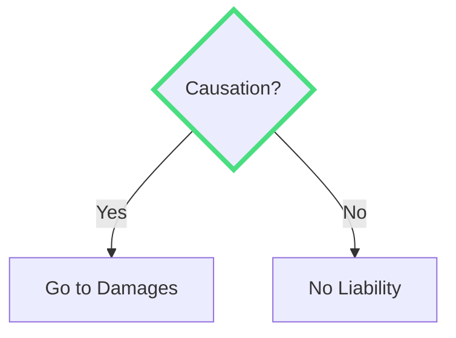

# test slide

---

layout: center
alias: step_duty
decision: true
question: "Duty?"
yesTarget: step_breach
noTarget: outcome_no
--------------------

# Element 1: Duty

Did D have a duty to P?



---

layout: center
class: text-center
alias: outcome_no
-----------------

# Outcome

Without having a duty to P, D cannot be liable.

---

layout: center
alias: step_breach
decision: true
question: "Breach?"
yesTarget: step_causation
noTarget: outcome_no
--------------------

# Element 2: Breach

Did D breach the duty to P?



---

layout: center
alias: step_causation
decision: true
question: "Causation?"
yesTarget: step_damages
noTarget: outcome_no
--------------------

# Element 3: Causation

Did the defendant's breach cause harm?



---

foo: bar
dragPos:
square: 527,93,167,_,-16
------------------------

# Draggable Elements

Double-click on the draggable elements to edit their positions.

<br>

###### Directive Usage

```md

```

<br>

###### Component Usage

```md
<v-drag text-3xl>
  <div class="i-carbon:arrow-up" />
  Use the `v-drag` component to have a draggable container!
</v-drag>
```

<v-drag pos="95,281,839,_,-15">
  <div text-center text-3xl border border-main rounded>
    Double-click me!
  </div>
</v-drag>


###### Draggable Arrow

```md
<v-drag-arrow two-way />
```

<v-drag-arrow pos="303,393,213,-202" two-way op70 />

---

layout: center
--------------


---

# Slidev

> Hello **world**

<style>
blockquote {
  strong {
    --uno: 'text-teal-500 dark:text-teal-400';
  }
}
</style>

<style>
/* Style for the Roman Numerals */
.legal-list {
  list-style-type: upper-roman !important;
  margin-left: 20px;
  line-height: 1.5;
}

/* Style for the Alpha (A, B, C) */
.alpha-list {
  list-style-type: upper-alpha !important;
  margin-left: 25px;
  line-height: 1.5;
}

/* Style for the Note */
.note {
  font-size: 0.85rem;
  opacity: 0.8;
  color: #3b82f6; /* Blue color */
  margin-left: 1.5rem;
  margin-bottom: 0.5rem;
  font-style: italic;
  line-height: 1.2;
}
</style>